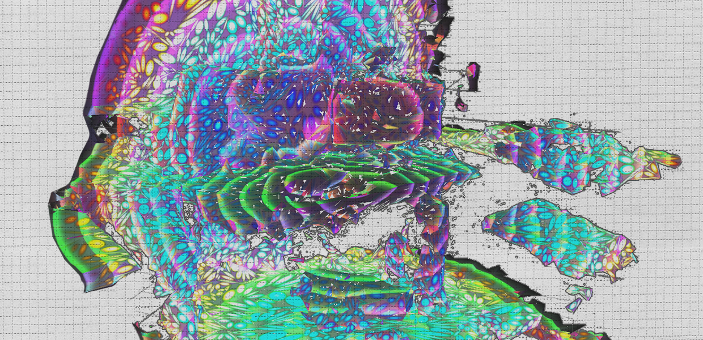

# lsrd - little surface reconstruction demo

This project was used to build a surface-reconstruction visualization. Aka spatial-mapping for HoloLens.

Note: Most screen-captures from HoloLens look terrible, as black colors are see-through on that display. The shaders take advantage of this and avoid transparency blending for performance reasons.

https://www.microsoft.com/en-us/p/lsrd/9nblggh4w6bg#activetab=pivot:overviewtab

https://docs.microsoft.com/en-us/windows/mixed-reality/design/spatial-mapping

https://www.google.com/search?q=lsrd+hololens
